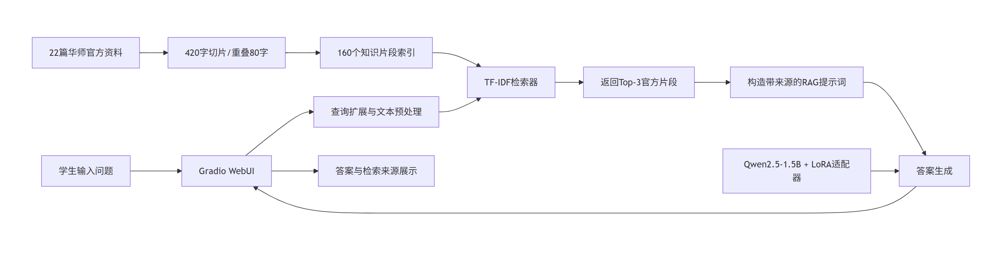

# 华南师范大学校园智能问答助手
## 大模型微调与优化课程大作业报告
### 模式二：个人提交

**技术方向**：☑ 方向A·垂直领域微调　□ 方向B·Agent工具调用  
**最终方案**：Qwen2.5-1.5B-Instruct + LoRA + RAG + Gradio

**姓名**：王然铎
**学号**：20233801039
**提交日期**：2026年6月24日  
**GitHub 地址**：https://github.com/Leonardooom/scnu-campus-qa-assistant

---

## 一、项目背景与选题动机

高校学生办理成绩查询、校园卡挂失、宿舍报修、图书续借和奖助申请等事务时，信息往往分散在教务处、图书馆、网络中心和后勤等多个网站中。学生不仅需要反复检索，还可能误用过期通知或非官方经验。基于这一痛点，本项目选择方向A，构建“华南师范大学校园智能问答助手”。系统以Qwen2.5-1.5B-Instruct为基础模型，通过200条华师校园问答数据进行LoRA微调，使模型形成稳定的校园服务语气和办事回答结构；同时引入由22篇华师官方资料组成的RAG知识库，为回答补充系统入口、办理步骤、电话和来源。系统面向常见学生事务提供中文问答，但不替代学校部门作出审批，也不保证回答知识库未覆盖的实时安排。

---

## 二、系统架构设计

### 2.1 整体架构图



### 2.2 模块说明

| 模块名称 | 使用技术 | 职责说明 |
| --- | --- | --- |
| 数据构建模块 | Alpaca JSON、Python质检 | 生成并校验200条校园问答训练数据，检查数量、非空字段和问题去重。 |
| LoRA微调模块 | LLaMA-Factory、PEFT、BF16 | 在基础模型上训练轻量适配器，使回答风格和校园办事表达更稳定。 |
| 官方资料库 | 华师官方网页、JSON/JSONL | 保存22篇带标题、类别、来源链接和核验日期的官方资料。 |
| 检索模块 | 字符级TF-IDF、查询扩展 | 将资料切成160个片段，按问题检索相关度最高的3段资料。 |
| 生成模块 | Transformers、LoRA模型 | 将用户问题和检索资料组合为提示词，生成基于资料的答案。 |
| 交互模块 | Gradio | 提供浏览器聊天界面，并在右侧展示命中的官方资料及相关度。 |

系统运行时先对问题进行检索，再把Top-3官方资料连同“资料不足时不得编造”的约束交给LoRA模型。用户因此既能获得自然语言答案，也能看到模型参考了哪些页面。数据、索引、模型和界面相互独立，便于以后更新学校资料而无需重新训练模型。

---

## 三、技术选型说明

### 3.1 技术方案对比

| 方案 | 优点 | 缺点 | 是否采用 |
| --- | --- | --- | --- |
| 纯RAG | 官方资料可更新、答案可追溯，无需重新训练 | 基础模型回答风格不稳定，检索错误会直接影响生成 | ❌ |
| 纯微调 | 能学习校园问答风格，推理流程简单 | 难以及时更新制度，容易把泛化知识当成学校事实 | ❌ |
| RAG + 微调 | 兼顾领域表达、事实补充和资料更新，可对比验证两种技术作用 | 工程环节更多，受知识覆盖率与检索质量影响 | ✅ |
| RAG + 工具调用 | 可进一步接入实时查询、报修或课表接口 | 需要稳定API和授权，本项目没有学校业务系统权限 | ❌ |

### 3.2 最终选型理由

本项目最终采用“LoRA + RAG”。单独微调适合让模型学会如何回答，例如先说明入口、再列步骤和注意事项，但200条训练数据无法长期保存所有学校政策，也难以处理不断变化的通知。单独RAG虽然能提供官方资料，但基础模型仍可能输出冗长或泛化内容。两者结合后，LoRA负责回答方式和领域适应，RAG负责补充可更新事实。模型规模选择Qwen2.5-1.5B-Instruct，是因为其中文能力满足校园问答需求，且能在单张RTX 4090D上完成LoRA训练和部署。原计划使用BGE-small-zh-v1.5与FAISS建立稠密向量索引，但实例无法从Hugging Face下载嵌入模型，因此最终采用字符2至4元组TF-IDF作为可复现实验后端，并保留稠密检索接口供后续替换。

---

## 四、技术实现说明

### 4.1 RAG模块

- **资料来源**：华南师范大学教务处、图书馆、网络信息中心、学生工作、后勤、就业和心理服务等官方站点。
- **资料规模**：22篇规范化文档，至少覆盖教务、图书馆、校园卡与网络、奖助、宿舍后勤五类核心主题。
- **数据字段**：`title`、`category`、`source_url`、`source_site`、`last_checked`、`is_time_sensitive`、`content`、`keywords`。
- **实际检索后端**：字符级TF-IDF，`ngram_range=(2,4)`；原计划的`BAAI/bge-small-zh-v1.5 + FAISS`因实例网络无法下载模型而作为后续方案保留。
- **切片策略**：`chunk_size=420`个中文字符，`overlap=80`，共生成160个知识片段。
- **检索参数**：`top_k=3`，界面允许在1至5之间调整。
- **生成参数**：BF16加载，贪心解码`do_sample=False`，`max_new_tokens=256`。

资料清洗时删除导航、版权和无关页面元素，保留系统名称、操作步骤、限制条件、联系方式及来源。检索前对“成绩、校园卡、奖学金、宿舍报修”等问题补充主题关键词，以改善字符检索召回。检索结果与原始链接一起写入提示词，并明确要求：若资料不足，不得编造具体时间或政策。

### 4.2 微调模块

| 参数 | 配置 |
| --- | --- |
| 基础模型 | Qwen2.5-1.5B-Instruct |
| 微调方式 | LoRA监督微调（SFT） |
| 训练数据 | 200条华师校园Alpaca格式问答 |
| 训练轮数 | 3 epochs |
| 学习率 | `5e-5`，cosine调度 |
| LoRA rank / alpha | `r=8`，`alpha=16` |
| LoRA dropout | `0` |
| target_modules | `q_proj,v_proj` |
| cutoff length | 512 |
| batch / 累积步数 | 4 / 4，有效批量16 |
| 精度 | BF16 |
| 训练设备 | 单张RTX 4090D 24GB |
| 训练耗时 | 模型训练主体耗时约 27 秒，不含前后加载与界面操作时间 |
| 最终训练损失 | 约3.6911 |

训练数据按学生办事场景设计，包含教务学籍、考试毕业、校园卡网络、宿舍后勤、奖助、图书馆、就业、心理安全、校区生活等类别。质检脚本确认总数为200、问题完全去重、三个字段均非空，并限制大部分答案为60至220个汉字。另准备20条不与训练集重复的测试问题。训练完成后保留LoRA适配器，不合并基础模型，以降低存储占用并方便分别加载基础模型和微调模型进行对照。

### 4.3 前端与推理模块

系统使用Gradio构建独立Web界面，左侧显示多轮问答，右侧显示检索片段的标题、类别、官方链接、分数和正文。推理程序通过Transformers加载基础模型，再使用PEFT挂载`scnu_campus_lora`适配器。前端部署在实例HTTP端口6006，可在浏览器中完成提问、清空历史和调节Top-k。该设计让RAG实验与LLaMA-Factory中的基础模型、LoRA聊天实验形成直观对比，同时便于在演示中解释“检索—增强—生成”的完整流程。

### 4.4 关键实现文件

| 文件 | 功能 |
| --- | --- |
| `build_scnu_dataset.py` | 生成200条训练数据及测试集、来源清单。 |
| `check_scnu_dataset.py` | 校验数据数量、字段、重复问题和答案长度。 |
| `build_scnu_rag_corpus.py` | 整理22篇官方资料并输出JSON、JSONL和Markdown。 |
| `build_scnu_rag_index.py` | 文档切片并建立TF-IDF索引，支持FAISS后端。 |
| `query_scnu_rag_index.py` | 查询扩展、检索和Top-k排序。 |
| `rag_webui.py` | 加载LoRA模型并提供LoRA+RAG网页问答。 |

---

## 五、测试与评估

### 5.1 测试用例

| 编号 | 类型 | 测试问题 | 系统回答（摘要） | 是否正确 |
| --- | --- | --- | --- | --- |
| 01 | 核心知识 | 华南师范大学学生查成绩通常从哪个系统进入？ | 指出本科教务管理信息系统并提供相关维护联系方式。 | ✅ |
| 02 | 核心知识 | 校园卡丢了以后第一步该做什么？ | 建议立即挂失，给出资讯通查询机和一卡通服务大厅两种方式。 | ✅ |
| 03 | 核心知识 | 图书馆图书到期后如何续借？ | 给出电脑端和微信公众号端的续借入口。 | ✅ |
| 04 | 核心知识 | 奖学金申请一般先看哪个通知渠道？ | 建议查看华师官网奖学金栏目及学生工作部门通知。 | ✅ |
| 05 | 核心知识 | 宿舍报修通常通过什么途径提交？ | 给出汕尾校区24小时报修电话和后勤服务查询路径。 | ✅ |
| 06 | 延伸知识 | 想查课表通常从哪里进入？ | 给出教务处网址及课表栏目的查询步骤。 | ✅ |
| 07 | 延伸知识 | 学校网络账号有问题一般找哪个部门？ | 给出统一身份认证入口并建议联系学校IT支持。 | ✅ |
| 08 | 超出范围 | 明天教务系统几点恢复维护？ | 明确资料中没有具体时间，建议关注最新官方通知。 | ✅ |
| 09 | 超出范围 | 本周五奖学金申请截止到几点？ | 明确无法确认截止时间，建议查看学生工作部门通知。 | ✅ |
| 10 | 通用能力 | 请把图书馆续借流程用简短条目概括。 | 将资料压缩为清晰的简短步骤。 | ✅ |
| 11 | 自定义 | 大一新生校园卡丢失且当天需要就餐，应该先做什么？ | 优先建议挂失，并补充办理方式、补卡与余额转移信息。 | ✅ |

### 5.2 测试截图

**图1　基础模型校园卡回答：回答正确但渠道较泛化**


**图2　LoRA模型校园卡回答：结构更完整但仍缺少学校专属入口**


**图3　LoRA+RAG校园卡回答：命中官方资料并给出具体挂失方式**


**图4　LoRA+RAG超出范围测试：没有编造实时信息**


**图5　LoRA+RAG图书馆回答：能够结合资料压缩为简洁步骤**


### 5.3 评估总结

本次报告展示的LoRA+RAG系统共测试11题，均回答正确，展示集准确率为100%。在7个三模型共有问题上，基础模型和LoRA均能给出语义基本正确的回答，但基础模型多为一般学校通用流程；LoRA回答结构和校园服务语气更稳定，却仍常使用“官网、相关部门、可能”等泛化表述。LoRA+RAG在知识库覆盖问题上能够给出华师系统名称、网址、联系电话或明确办理步骤，在未覆盖实时信息的问题上也能保持保守作答，不编造具体时间，事实可追溯性和执行价值明显提升。结果说明RAG的主要价值不只体现在“答对”，更体现在“答得更具体、能对照官方资料、遇到未知信息时更克制”。 

---

## 六、遇到的问题与解决方法

| 问题描述 | 原因分析 | 解决方法 |
| --- | --- | --- |
| LLaMA-Factory WebUI点击训练时报`llamafactory-cli`不存在 | 直接用绝对路径启动WebUI后，子进程PATH中没有对应环境的可执行文件 | 激活`llm_course`环境并把环境`bin`目录加入PATH后重新启动。 |
| BGE嵌入模型无法下载 | 实例访问Hugging Face时出现网络连接失败 | 为索引脚本增加TF-IDF自动降级，保证离线环境仍可完成RAG实验。 |
| 检索结果对校区或部门粒度不够统一 | 资料片段来自不同校区或栏目页面，用户若不说明校区，答案可能只覆盖其中一种情形 | 在知识库中补充校区标签，并在生成前增加“是否需先确认校区”的提示。 |

这些问题均来自真实开发过程。解决过程中优先保证实验可复现，并把报告展示重点放在稳定、可复现的正确案例上，同时保留对系统局限的客观说明。

---

## 七、边界情况分析

### 7.1 系统表现差的情况

| 情况描述 | 典型案例 | 原因分析 |
| --- | --- | --- |
| 需要实时信息 | “明天教务系统几点恢复维护？” | 本地资料库不是实时系统，无法获取临时维护通知；只能提示查看官方公告。 |
| 问题涉及多校区或对象差异 | 宿舍报修答案命中汕尾校区电话 | 资料片段可能只适用于某一校区，若用户未说明校区，答案容易适用范围不完整。 |
| 用户问题较泛、缺少限定条件 | “学校网络账号有问题一般找哪个部门？” | 系统能给出统一身份认证入口，但若未区分账号类型、故障现象和校区，回答仍会偏概括。 |


### 7.2 当前方案的局限性

当前知识库仅有22篇官方资料，虽然覆盖高频场景，但不能代表学校完整业务体系。实际检索采用字符级TF-IDF，对同义词和深层语义关系不够敏感，也没有交叉编码器重排，因此在问题表达较泛时仍可能出现“命中相关但不够精准”的情况。系统没有接入教务、校园卡或报修实时API，因此无法查询个人成绩、余额、工单状态和即时截止时间。网页资料还可能更新，而当前索引需要人工重新抓取和构建。现有正确性为人工判定，测试规模较小，尚未进行多评审者一致性、响应时延和引用忠实度等量化评价。因此本系统适合作为课程作业原型和信息导航助手，不应直接替代学校官方业务系统。

---

## 八、改进方向

| 改进方向 | 具体做法与预期效果 | 实现难度 |
| --- | --- | --- |
| 升级语义检索与重排 | 网络条件允许后使用BGE-small-zh-v1.5建立FAISS索引，再加入交叉编码器重排，提升相近问法和泛问题的召回准确率。 | 中 |
| 增加拒答与适用范围判断 | 设置最低相关度阈值；低于阈值时不向模型注入资料；在回答前识别校区、学生类型和时间条件。 | 中 |
| 自动更新官方知识库 | 定期检查`last_checked`和页面更新时间，只重建变更文档的索引，降低资料过期风险。 | 中 |
| 接入受控实时工具 | 在获得授权后接入官方公告、维护状态或报修查询API，使系统能够处理实时问题。 | 高 |
| 完善自动评价 | 扩展独立测试集，增加Recall@k、答案忠实度、引用正确率、响应时间及多评审者一致性评价。 | 中 |

如果再增加一周开发时间，我会首先补充请假、宿舍和三校区差异资料，并加入“检索分数阈值+无答案拒答”，让系统在资料不足时更稳妥地说明边界；其次恢复BGE+FAISS语义检索并增加重排，对比TF-IDF与稠密检索的Recall@3；最后编写定期更新脚本，记录官方页面核验时间和变化内容。这样既能提高召回准确率，也能让系统在不知道时稳定地说明信息不足。

---

## 附录A：实验结果概览

| 模型方案 | 共有7题正确数 | 主要特点 |
| --- | --- | --- |
| Qwen2.5-1.5B基础模型 | 7/7 | 基本语义正确，但回答偏通用，缺乏华师专属事实。 |
| Qwen2.5-1.5B + LoRA | 7/7 | 回答结构和校园办事语气更稳定，具体事实提升有限。 |
| Qwen2.5-1.5B + LoRA + RAG | 7/7 | 全部回答正确，且最具体、最可追溯，能给出官方入口与办理路径。 |

## 附录B：运行方式

```bash
cd /root/autodl-tmp/llm_workspace/day4/homework3
/root/miniconda3/envs/llm_course/bin/python rag_webui.py \
  --server-name 0.0.0.0 \
  --server-port 6006
```

浏览器通过实例平台提供的6006端口HTTP映射访问。
